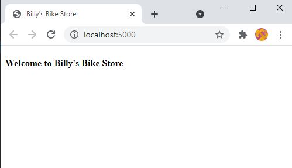
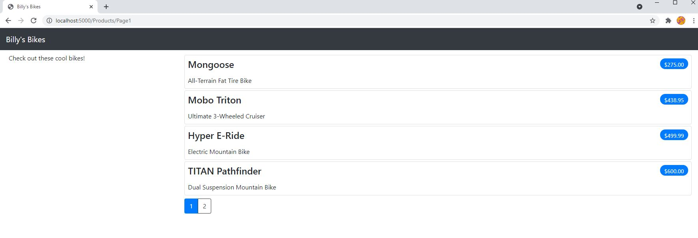

# Billys-Bike-Store
Billy's famous bike store modelled off the "Sports Store" application from the book "Pro ASP.NET Core 3" by Adam Freeman

## Creating the Solution
```
dotnet new globaljson --sdk-version 5.0.103 --output BillysBikeStoreSln/BikeProducts
dotnet new web --no-https --output BillysBikeStoreSln/BikeProducts --framework net5
dotnet new sln -o BillysBikeStoreSln
dotnet sln BobsStoreSln add BillysBikeStoreSln/BikeProducts
dotnet new xunit -o BillysBikeStoreSln/BikeProducts.Tests --framework net5
dotnet sln BillysBikeStoreSln add BillysBikeStoreSln/BikeProducts.Tests 
dotnet add BillysBikeStoreSln/BikeProducts.Tests reference BillysBikeStoreSln/BikeProducts
```

### Progress Check 1 (Page 128)


## Entity Framework
* What is Entity Framework?
* What is a Connection String?
* What is a Database Context?
* What is a Model Repository?
* Migration vs Scaffolding?
* Seeding the database

## Displaying the Products

