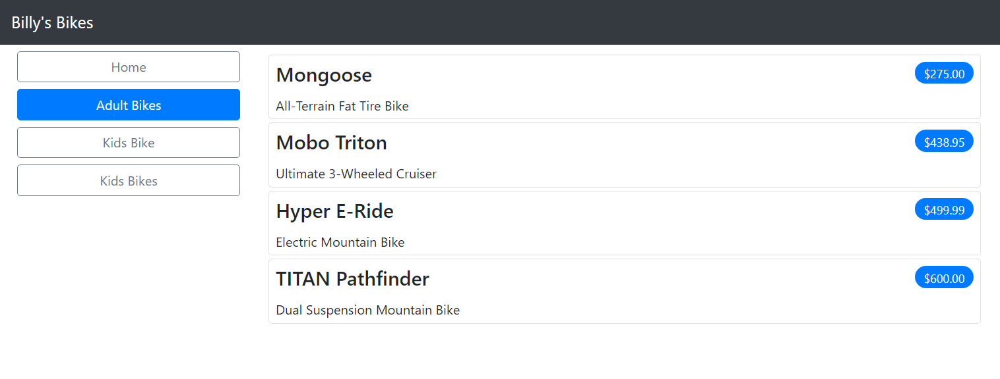
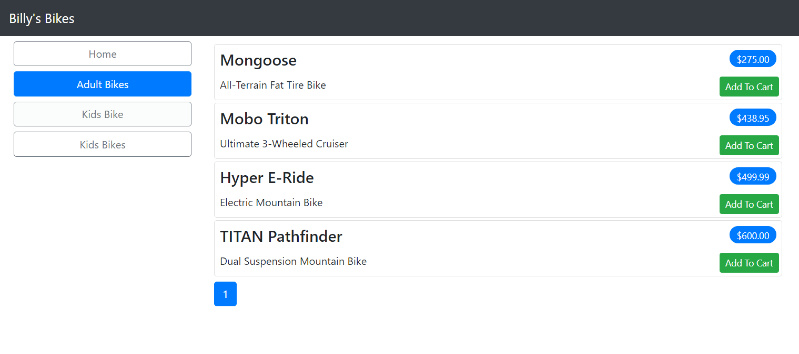
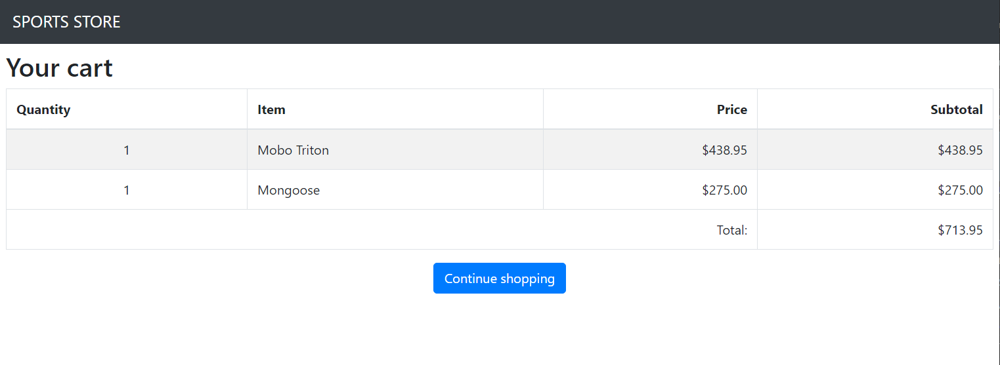

# Billys-Bike-Store
Billy's world famous bike store modelled off the "Sports Store" application from the book "Pro ASP.NET Core 3" by Adam Freeman

## Creating the Solution
```
dotnet new globaljson --sdk-version 5.0.103 --output BillysBikeStoreSln/BikeProducts
dotnet new web --no-https --output BillysBikeStoreSln/BikeProducts --framework net5
dotnet new sln -o BillysBikeStoreSln
dotnet sln BobsStoreSln add BillysBikeStoreSln/BikeProducts
dotnet new xunit -o BillysBikeStoreSln/BikeProducts.Tests --framework net5
dotnet sln BillysBikeStoreSln add BillysBikeStoreSln/BikeProducts.Tests 
dotnet add BillysBikeStoreSln/BikeProducts.Tests reference BillysBikeStoreSln/BikeProducts
```

### Progress Check 1 (Page 128)


## Entity Framework
* What is Entity Framework?
   * The Entity Framework is a framework that allows developers to work with data without having to focuse on the underlying data table.
* What is a Connection String?
   *  A connection string is a string that specifies information about the data source, such as name of server, as well as it may carry authentication information such as usernames and passwords.
* What is a Database Context?
   * The database context is the connection to the database. It is used to query or to save data to the database.
* What is a Model Repository?
  * A model repository is a data repository that is modelled off the models created for the application.
* Migration vs Scaffolding?
  * Scaffolding creates all the basic CRUD operations dynamically, migration does not auto implement the CRUD operations but allows you to connect your application to the data source.
* Seeding the database
  * Seeding the database is the process of added data to your database to verify functionallity. 

## Displaying the Products


### Figure 8-5


### Figure 8-10


### Figure 8-11


